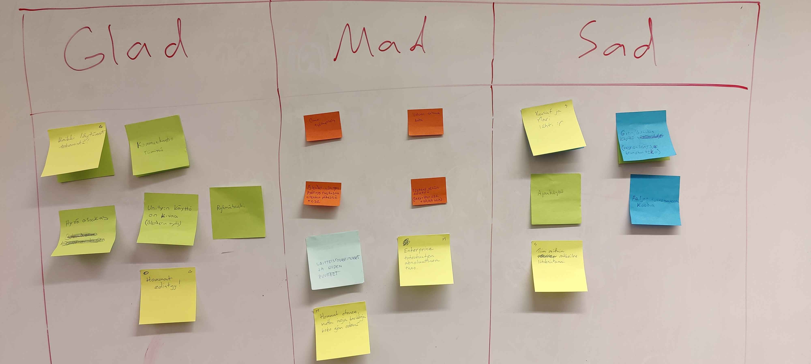

# Retro

- Kampuksella
- 13:00 - 14:00
- Paikalla
  - Teemu
  - Santeri
  - Santtu
  - Fabio
- Osallistujat saapuivat ajallaan

#### Glad
- Hommat edistyy
- Kaikki löytäneet tekemistä
- Hyvä asiakas
- Unityn käyttö kivaa
- Kommunikaatio hyvä
- Ryhmähenki erittäin hyvä
- Töiden jako

#### Sad
- Yuusuf ja Mari lähti
- Ryhmä rakoilee liitoksistaan
- Githubin käyttö >> taskit laittamatta
- Projektissa paljon tuntematonta koodia, aikaa katsoa tätä
- Pull requesteja voisi opiskella
- Oma ajankäyttö

#### Mad
- Enterprise toteutuksien sekavuus ja ajan tuhlaus niihin
- Karikkoja matkalla
- Valven tarjoama data
- Raskaita Unityn
- Testaus kökköä
- Kovalevytila loppumassa
- Laitteistovaatimukset rassaa

### Teemat
- Githubin branches ja pull requests tutustumista (parikoodausta)
- tutkitaan C# yksikkötestausta
- Luodaan #ongelmat kanava
- dokumentaation tuottamista, siltä osin kuin mahdollista, suoraan gittiin 
- pull requestit discordiin
- suunnitelurepoon kaikki dokumentaatio (Luukkaiselle oikeudet)
