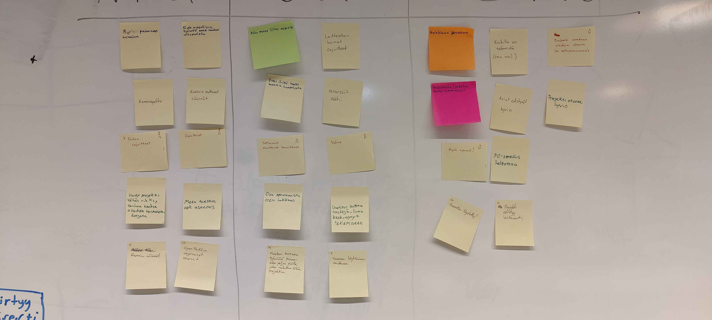

# Retro

- Kampuksella
- 13:00 - 14:00

- Paikalla
  - Teemu
  - Santeri
  - Santtu
  - Fabio
  - Kristian

- Osallistujat saapuivat ajallaan

#### Mad
- Ei voi työstää projektia oman raudan ulkopuolelta
- Projektin painavuus, paljon asiaa ja tekemistä
- Kurssin muuttuvat säännöt
- Kamerapakko
- OpenShift
- Dataan liittyvät rajoitteet
- Unity projekti tällä hetkellä hieman rikki
- MetaQuestin APK asennus tarpeettoman monimutkainen
- Kurssin muuttuvat säännöt ja niistä kommunikointi
- Openshift vajavaiset resurssit

#### Sad
- Aika menee liian nopeasti
- Ei saatu konetta kampuksella käyttöön
- Laitteiston rajoitteet (esim. lasien suorituskyky)
- Resurssit tökkii, esim. OpenShiftin rajoitteet
- Jatkuvasti muuttuvat tavoitteet (esim. MetaQuest >> SteamVR)
- Valve
- Osa kartan optimoinnista meni hukkaan
- Unohti laittaa taskeja
- Muut kurssit painaa päälle
- Projektin suunnan löytämiseen meni aikaa

#### Glad
- Asiakkaan joustavuus, luottaa meidän visioon
- Kasvokkain kommunikointi toimii
- Kaikilla tekemistä
- Asiat edistyvät hyvin
- Hyvä ryhmä
- Projekti saadaan alkuun
- Projekti etenee hyvin
- PC-sovellus helpottaa
- Projektin suunnan löytyminen
- Projekti edistyy

### Teemat / korostukset / ratkaisut
- Kurssin vetäjät voisivat kommunikoida sääntömuutoksista johdonmukaisemmin ja kootummin.
- MetaQuest + APK-build ei jatkossa vaatimus, koska toteutus on tästä eteenpäin SteamVR pohjainen.
- OpenShift ratkeaa, toivottavasti, sitten kun olemme tehneet sisäiset benchmarkit valitun parserin ja demodata parissa.
- Unity projektin saattamisen siihen tilaan, että sitä voi muutkin ryhmän jäsenet työstää.
- Dataan liittyvät ongelmat ratkaistu tarkentamalla projektin "use case".
- Rautaan liittyvät haasteet rajaavat tekemistä, esim. Unity vaatii koneelta tehoa, VR-lasien saatavuus rajoittaa, mutta samanaikaisesti backendin työstäminen käy jopa fuksiläppäriltä.
- Pilkkoo työt pienemmiksi taskeiksi ja muistaa lisätä niitä Githubiin.
- Projekti etenee ja suunta löydetty, jatketaan samaan malliin.
- Jatketaan hyvää kommunikointia ja avun pyytämistä muilta ryhmän jäseniltä.