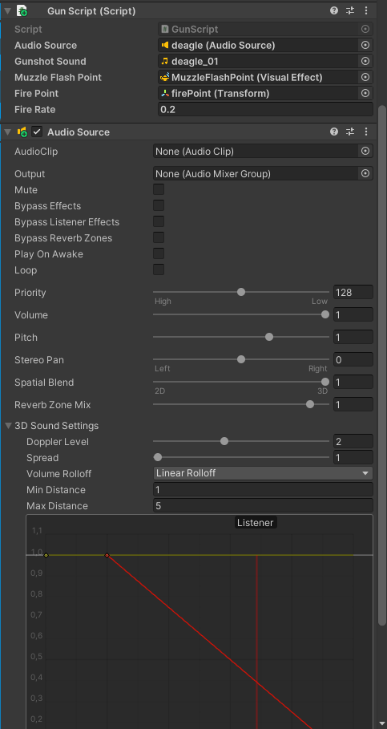

# Pistoolit

1. Valitse hahmon prefab: Animation/animations/Phoenix.prefab tai Animation/animations/FBI/FBI.prefab

2. Tee aseesta prefab, jos sitä ei vielä ole (helpottaa aseen kopioimista muille hahmoille):
  * Siirrä ase hierarchyyn ja siirrä takaisin "Projects" ja nyt sinne ilmestyy esim. deagle.prefab


3. Siirrä ase(prefab) hahmon weaponHolderiin.

  * Kopioi alla oleva kyseiseen aseeseen(prefab). Riippuen aseesta, voi joutua asettelemaan tarkemmin:


Kädessä oleva ase:
```bash
UnityEditor.TransformWorldPlacementJSON:{"position":{"x":0.005505432840436697,"y":0.010460630059242249,"z":-0.00005298554606270045},"rotation":{"x":-0.5549819469451904,"y":-0.0638723075389862,"z":-0.3035511374473572,"w":-0.7718632221221924},"scale":{"x":0.009999999776482582,"y":0.009999999776482582,"z":0.009999999776482582}}
```
* Valitse ase hierarchyssa. Inspectorissa Transformin oikealla paina kolmea pistettä -> Paste -> World Transform
* Tarkista scenessä, että ase on hahmon kädessä ja oikean kokoinen.
* Jos näet vain edellisen aseen hahmon kädessä, voit piilottaa sen klikkaamalla hierarchyssa kyseistä asetta ja Inspectorissa poistamalla checkboxista ruksi.

4. Animation/prefab:stä löytyy firePoint.prefab ja MuzzleFlashPoint 1.prefab. Siirrä ne aseeseen hierarchyssa. (Nämä löytyy vasta animation_separation branchista)

5. Lisää aseelle(prefab) komponentit: Gun Script ja Audio Source

6. Muuta asetukset kyseisen aseen mukaan (joutuu varmasti vielä muuttamaan):



Ohjeet tarkentuvat myöhemmin!!
Kysykää Discordissa "Aseet ja äänet" langalla, jos tarvitsee tarkennusta tai korjausta.
