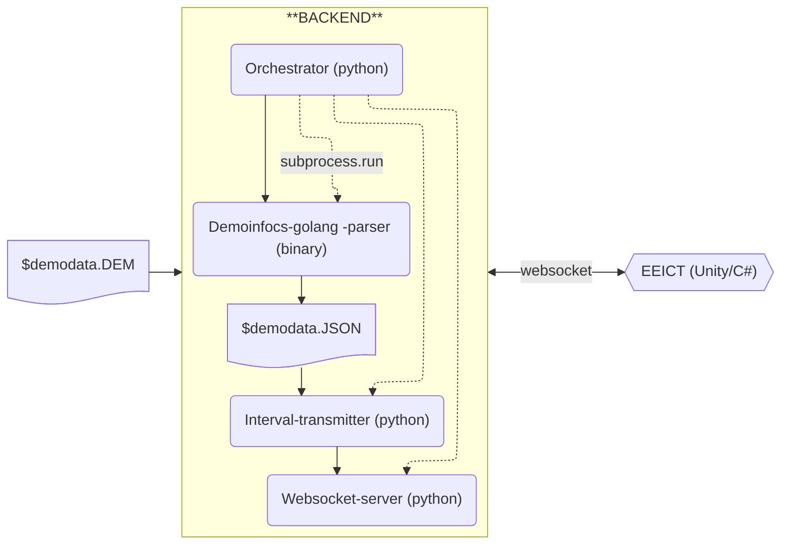

# CS2 demodatan siirto EEICT-sovellukseen

Backendin sovellusarkkitehtuuri kuvattuna kehittäjän näkökulmasta.
## Arkkitehtuurikuvaus

## Komponenttien vastuut

#### Orchestrator
- Vastuu: vastaa demodatan siirtymisestä eri komponenttien välillä.
#### Demoinfocs-golang
- Vastuu: CS2 \*.dem --> JSON -parseri.
- https://github.com/markus-wa/demoinfocs-golang
- Tallentaa JSON-datan saman nimiseen tiedostoon kuin lähdetiedosto.
- Mahdollisuus määrittää JSON-tiedostoon tulevien tapahtumien määrä/sekunti.
    - CS2 tukee enimmillään 64/128 tapahtumaa/sekunti, riippuen CS2 palvelimen asetuksista.
    - Kirjoittaa asetetun intervallin JSON-tiedostoon.
#### Interval-transmitter
- Vastuu: pilkkoo JSON-datan EEICT-sovellukselle siirtoa varten.
- Lukee parserilta saadun JSON-datan ja intervallin muistiin.
- Siirtää JSON-datan objekti kerrallaan, aiemmin määritetyllä tapahtumaa/sekunti intervallilla, eteenpäin seuraavalle komponentille.
#### Websocket-server
- Vastuu: muodostaa websocket protokollaa hyödyntäen yhteyden backendin ja EEICT-sovelluksen välille.