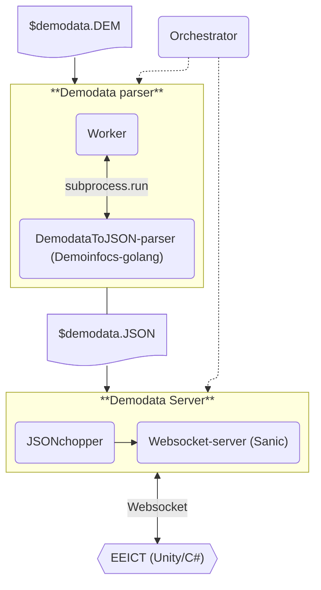

# CS2 demodatan siirto EEICT-sovellukseen (WIP)

Backendin sovellusarkkitehtuuri kuvattuna kehittäjän näkökulmasta.
## Arkkitehtuurikuvaus

## Komponenttien vastuut

#### Orchestrator
- Vastuu: demodatan siirtymisestä eri komponenttien välillä.
- Ohjelmointikieli: Python

### Demodata parser

Ottaa syötteenä Counter Strike 2:n tuottaman demodata tiedoston (\*.dem) ja tuottaa siitä EEICT-sovelluksen käyttöön soveltuvan JSON-tiedoston.
#### Worker
- Vastuu: demodatan siirtymisestä parserin läpi.
- Ohjelmointikieli: Python
#### DemodataToJSON-parser
- Vastuu: parsii CS2:n tuottaman demodatan JSON muotoon.
- Ohjelmointikieli: Go
- Hyödyntää kirjastoa: Demoinfocs-golang (https://github.com/markus-wa/demoinfocs-golang)
- Tallentaa parsitun JSON-datan saman nimiseen tiedostoon kuin lähdetiedosto.
- Mahdollisuus määrittää JSON-tiedostoon tulevien tapahtumien määrä/sekunti.
    - CS2 tukee enimmillään 64/128 tapahtumaa/sekunti, riippuen CS2-palvelimen asetuksista.
    - Kirjoittaa asetetun intervallin JSON-tiedostoon.

### Demodata Server

Ottaa syötteenä parserin tuottaman JSON-tiedoston ja lähettää sitä objekti kerrallaan websocket protokollaa hyödyntäen. Toimii myös itsenäisenä, kehittäjän koneella suoritettavana sovelluksena.
#### JSONchopper
- Vastuu: pilkkoo JSON-tiedoston yksittäisiksi objekteiksi EEICT-sovellukselle siirtoa varten.
- Ohjelmointikieli: Python
- Lukee parserilta saadun JSON-tiedoston muistiin.
- Siirtää JSON-tiedoston datan objekti kerrallaan, aiemmin määritetyllä tapahtumaa/sekunti intervallilla, eteenpäin seuraavalle komponentille.
#### Websocket-server
- Vastuu: muodostaa websocket protokollaa hyödyntäen yhteyden backendin ja EEICT-sovelluksen välille.
- Ohjelmointikieli: Python
- Hyödyntää kirjastoa: Sanic (https://sanic.dev/en/)

