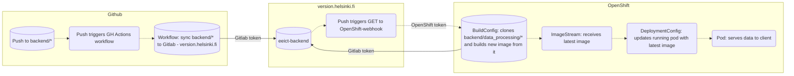

# EEICT - Backend

Tietoa projektissa käytetyistä järjestelmistä ja niiden yhteistoiminnasta.

#### Github Actions
- https://github.com/ohtuprojekti-Elisa/elisaohtuprojekti/blob/main/.github/workflows/push-to-version.helsinki.fi.yaml

#### GitLab (version.helsinki.fi)
- https://version.helsinki.fi/tebe/eeict

#### OpenShift (konttialusta)
- OpenShift web-konsoli
    - Tuotanto
        - https://console-openshift-console.apps.ocp-prod-0.k8s.it.helsinki.fi/
    - Testi
        - https://console-openshift-console.apps.ocp-test-0.k8s.it.helsinki.fi/

- Konttien päivityksestä
    - https://learn.redhat.com/t5/Containers-DevOps-OpenShift/Automatically-restarting-pods-when-the-secret-or-config-map-gets/td-p/28015

#### Projektin tuotantoympäristö (ohtuprojekti-staging/eeict-backend)
- DeploymentConfig
    - Testi
        - https://console-openshift-console.apps.ocp-test-0.k8s.it.helsinki.fi/k8s/ns/ohtuprojekti-staging/deploymentconfigs/eeict-backend
- ImageStream
    - Testi
        - https://console-openshift-console.apps.ocp-test-0.k8s.it.helsinki.fi/k8s/ns/ohtuprojekti-staging/imagestreams/eeict-backend

- Ajossa olevan kontin API
    - Testi
        - https://eeict-backend-ohtuprojekti-staging.apps.ocp-test-0.k8s.it.helsinki.fi
- Kontin rajapinta
    - Tuotanto
        - https://eeict-backend-ohtuprojekti-staging.apps.ocp-test-0.k8s.it.helsinki.fi

#### Dataflow - projektin repositoriosta tuotantoon

