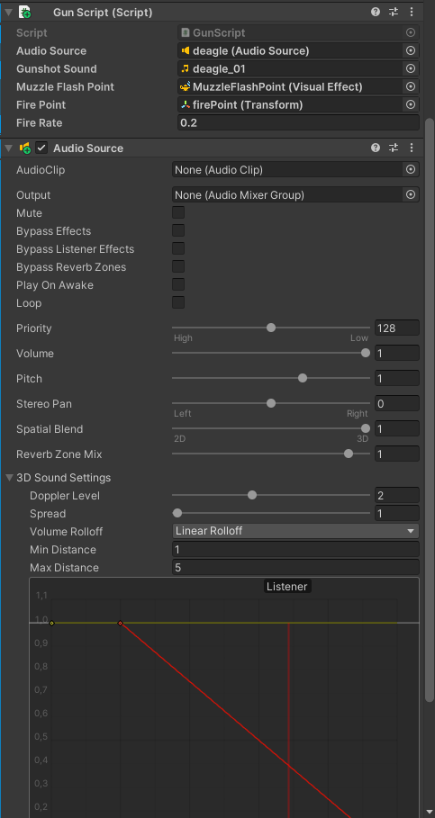

# Aseet

1. Valitse hahmon prefab: Animation/animations/Phoenix.prefab tai Animation/animations/FBI/FBI.prefab

2. Tee aseesta prefab, jos sitä ei vielä ole (helpottaa aseen kopioimista muille hahmoille):
  * Siirrä ase hierarchyyn ja siirrä takaisin "Projects" ja nyt sinne ilmestyy esim. deagle.prefab
  * Nimeä prefab alla olevan listan mukaan.


3. Siirrä ase(prefab) hahmon weaponHolderiin.

  * Kopioi alla oleva kyseiseen aseeseen(prefab). Riippuen aseesta, voi joutua asettelemaan tarkemmin:


Kädessä oleva ase:
```bash
UnityEditor.TransformWorldPlacementJSON:{"position":{"x":0.005505432840436697,"y":0.010460630059242249,"z":-0.00005298554606270045},"rotation":{"x":-0.5549819469451904,"y":-0.0638723075389862,"z":-0.3035511374473572,"w":-0.7718632221221924},"scale":{"x":0.009999999776482582,"y":0.009999999776482582,"z":0.009999999776482582}}
```
* Valitse ase hierarchyssa. Inspectorissa Transformin oikealla paina kolmea pistettä -> Paste -> World Transform
* Tarkista scenessä, että ase on hahmon kädessä ja oikean kokoinen.
* Jos näet vain edellisen aseen hahmon kädessä, voit piilottaa sen klikkaamalla hierarchyssa kyseistä asetta ja Inspectorissa poistamalla checkboxista ruksi.

## Myöhemmin:
4. Animation/prefab:stä löytyy firePoint.prefab ja MuzzleFlashPoint 1.prefab. Siirrä ne aseeseen hierarchyssa. (Nämä löytyy vasta animation_separation branchista)

5. Lisää aseelle(prefab) komponentit: Gun Script, Audio Source ja Weapons
  * Weaponsista valitse mihin kategoriaan ase kuuluu. (Tärkeä, että aseelle tulee oikeat animaatiot!)

6. Muuta asetukset kyseisen aseen mukaan (joutuu varmasti vielä muuttamaan):



Ohjeet tarkentuvat myöhemmin!!
Kysykää Discordissa "Aseet ja äänet" langalla, jos tarvitsee tarkennusta tai korjausta.

1. **AK-47  / Rifle | Phoenix/FBI |**
2. **AUG  / Rifle | Phoenix/FBI |**
3. **AWP  / Sniper | Phoenix/FBI |**
4. **PP-Bizon / SMG | Phoenix/FBI |**
5. C4 / Bomb
6. **Desert Eagle / Pistol  | Phoenix/FBI |**
7. Decoy Grenade  / Grenade
8. Dual Berettas  / Dual Pistols
9. **FAMAS  / Rifle | Phoenix/FBI |**
10. **Five-SeveN  / Pistol  | Phoenix/FBI |**
11. Flashbang / Grenade
12. **G3SG1 / Rifle | Phoenix/FBI |**
13. **Galil AR  / Rifle | Phoenix/FBI |**
14. **Glock-18  / Pistol  | Phoenix/FBI |**
15. HE Grenade  / Grenade
16. **P2000 / Pistol  | Phoenix/FBI |**
17. Incendiary Grenade  / Grenade
18. **M249  / Heavy | Phoenix/FBI |**
19. **M4A4  / Rifle | Phoenix/FBI |**
20. **MAC-10  / SMG | Phoenix/FBI |**
21. **MAG-7 / Shotgun | Phoenix/FBI |**
22. Molotov / Grenade
23. **MP7 / SMG | Phoenix/FBI |**
24. **MP5-SD  / SMG | Phoenix/FBI |**
25. **MP9 / SMG | Phoenix/FBI |**
26. **Negev / Heavy | Phoenix/FBI |**
27. **Nova  / Shotgun | Phoenix/FBI |**
28. **P250  / Pistol  | Phoenix/FBI |**
29. **P90 / SMG | Phoenix/FBI |**
30. **Sawed-Off / Shotgun | Phoenix/FBI |**
31. **SCAR-20 / Sniper | Phoenix/FBI |**
32. **SG 553  / Rifle | Phoenix/FBI |**
33. Smoke Grenade / Grenade
34. **SSG 08 / Sniper | Phoenix/FBI |**
35. **Zeus x27  / Pistol  | Phoenix/FBI |**
36. **Tec-9 / Pistol  | Phoenix/FBI |**
37. **UMP-45  / SMG | Phoenix/FBI |**
38. **XM1014  / Shotgun | Phoenix/FBI |**
39. **M4A1  / Rifle | Phoenix/FBI |**
40. **CZ75 Auto / Pistol  | Phoenix/FBI |**
41. **USP-S / Pistol  | Phoenix/FBI |**
42. **R8 Revolver / Pistol  | Phoenix/FBI |**
43. Kevlar Vest / ---
44. Kevlar + Helmet / ---
45. Defuse Kit  / ---
46. **Knife / Knife | Phoenix/FBI |**

**Boldatut** on lisätty molemmille hahmoille.
